# Localstack practices

Localstack reference:

https://localstack.cloud

Benefits:

- You can work offline
- You don't need a shared 'dev' bucket that everyone on your team uses
- You can easily wipe & replace your local buckets
- You don't need to worry about paying for AWS usage
- You don't need to log into AWS 😛

Stack:

- Nodejs
- Express
- [brew if is necesary](https://brew.sh/)
- Localstack (AWS suit)
- Docker & Docker Compose
- Jest & SuperTest for testing
- Swagger for documentation

---

## First Goal (Fake AWS locally with LocalStack)

[Reference](https://dev.to/goodidea/how-to-fake-aws-locally-with-localstack-27me)

**Localstack within a node app**

Localstack allows you to emulate a number of AWS services on your computer. We are going to use a S3 iin this example.

**Initial setup**

1. Install [docker](https://docs.docker.com/get-docker) if you haven't already.
2. Install **AWS CLI** [oficial](https://aws.amazon.com/es/cli/) or [using brew](https://formulae.brew.sh/formula/awscli), even though we aren't going to be working with "real" AWS, we'll use this to talk to our local docker containers.
3. Once the AWS CLI is installed, run `aws configure` to create some credentials. Even though we're talking to our "fake" local service, we still need credentials. You can enter real credentials (as described [here](https://docs.aws.amazon.com/cli/latest/userguide/cli-chap-configure.html)), or dummy ones. Localstack requires that these details are present, but doesn't actually validate them.
4. Create a new directory for you project, and within it a new nodejs project `npm init -y`.
5. Make a few files inside you project:

- aws.js
- docker-compose.yml
- test-upload.js
- .env

6. Add an image to your project directory and rename it to `test-upload.jpg`.
7. Install aws-sdk, dotenv `npm install --save aws-sdk dotenv`

**Docker config**

Run Localstack with docker-compose to set this up.

`docker-compose.yml`

```yml
version: "3.2"
services:
  localstack:
    image: localstack/localstack:0.11.3
    container_name: "fake-aws-s3"
    network_mode: bridge
    ports:
      - "4566:4566"
      - "8055:8080"
    environment:
      - SERVICES=s3
      - DEBUG=1
      - DATA_DIR=/tmp/localstack/data
    volumes:
      - "./.localstack:/tmp/localstack"
      - "/var/run/docker.sock:/var/run/docker.sock"
```

The line `4566:4566` does the same thing, but binds a whole range of ports. These particular port numbers are what Localstack uses as endpoints for the various APIs. We'll see more about this in a little bit.

`SERVICES=s3`: You can define a list of AWS services to emulate. In our case, we're just using S3, but you can include additional APIs, i.e.

`SERVICES=s3,lambda`: There's more on this in the Localstack docs.

`DEBUG=1`: 🧻 Show me all of the logs!

`DATA_DIR=/tmp/localstack/data`: This is the directory where Localstack will save its data internally.

**Starting our container**

Run in terminal:

`docker-compose up`

To make sure it's working, we can visit http://localhost:8055 to see localstack's web UI:

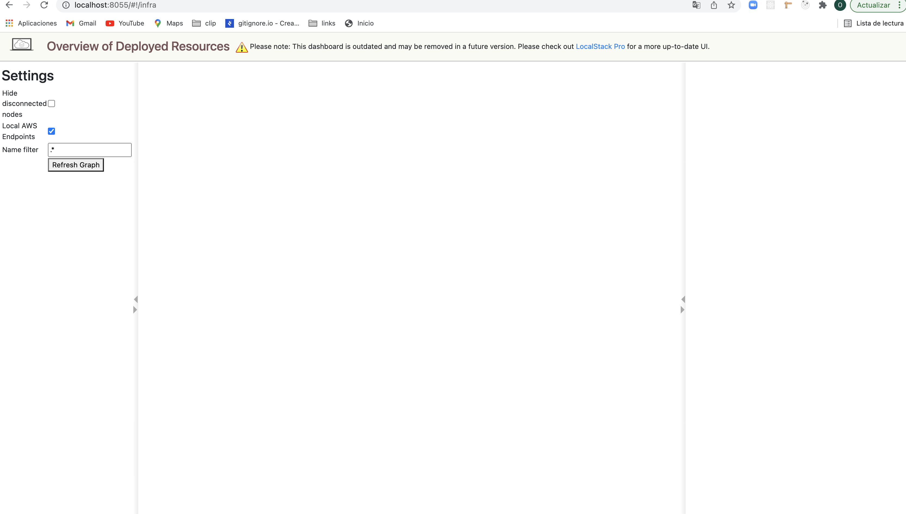

Similary, our s3 endpoint http://localhost:4566:

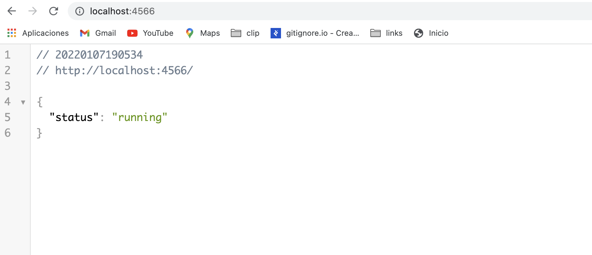

**Working with Localstack**

AWS is now inside our computer. After we start upload files, we need to create and configure a **bucket**. We will do this using rhw AWS CLI that we installed earlier, using the `-- endpoint-url` flag to talk to Localstack instead.

1. Create a bucket: `aws --endpoint-url=http://localhost:4566 s3 mb s3://demo-bucket`
2. Attach an [ACL](https://docs.aws.amazon.com/AmazonS3/latest/userguide/acl-overview.html) (Access control list) to the bucket so it's readable: `aws --endpoint-url=http://localhost:4566 s3api put-bucket-acl --bucket demo-bucket --acl public-read`

Now, when we visit the web UI, we will see our bucket:
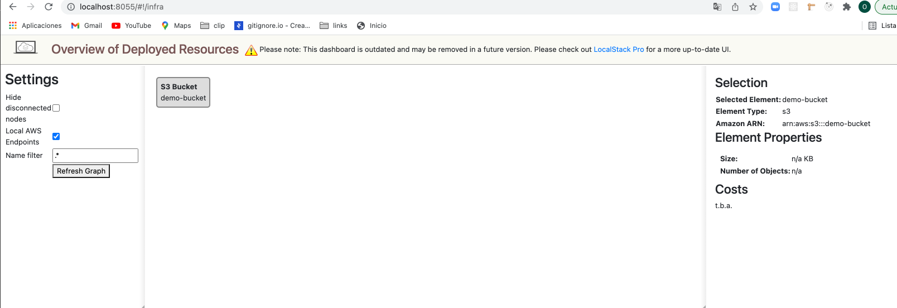

If you use `volumes` in your docker settings, let's paause for a moment to look at what's going on in `./.localstack/data`:

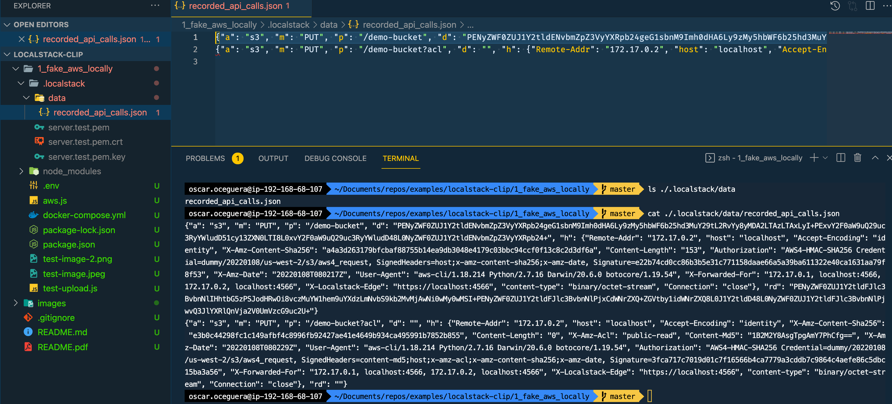

Here, we can see that Localstack is recording all API calls in this JSON file. When the container restarts, it will re-apply these calls - this is how we are able to keep our data between restarts. Once we start uploading, we won't see new files appear in this directory. Instead, our uploads will be recorded in this file as raw data. (You could include this file in your repo if you wanted to share the state of the container with others - but depending on how much you upload, it's going to become a pretty big file)

**Uploading from our app**

We will just make a simple **upload** function and try uploading an image a few times to our S3 butcket.

`.env`, our enviroment variables

```
AWS_ACCESS_KEY_ID='123'
AWS_SECRET_KEY='xyz'
AWS_BUCKET_NAME='demo-bucket'
```

_Note: it doesn't matter what your AWS key & secret are, as long as they aren't empty._

`aws.js`, the module for our upload function

```js
const AWS = require("aws-sdk");
require("dotenv").config();

const credentials = {
  accessKeyId: process.env.AWS_ACCESS_KEY_ID,
  secretAccessKey: process.env.AWS_SECRET_KEY,
};

const useLocal = process.env.NODE_ENV !== "production";

const bucketName = process.env.AWS_BUCKET_NAME;

const s3client = new AWS.S3({
  credentials,
  endpoint: useLocal ? "http://localhost:4566" : undefined,
  s3ForcePathStyle: true,
});

const uploadFile = async (data, name) =>
  new Promise((resolve) => {
    s3client.upload(
      {
        Bucket: bucketName,
        Key: `${bucketName}/${name}`,
        Body: data,
      },
      (err, response) => {
        if (err) throw err;
        resolve(response);
      }
    );
  });

module.exports = uploadFile;
```

`test-upload.js`, which implements th eupload function

```js
const fs = require("fs");
const path = require("path");
const uploadFile = require("./aws");

const testUpload = () => {
  const filePath = path.resolve(__dirname, "test-image.jpg");
  const fileStream = fs.createReadStream(filePath);
  const now = new Date();
  const fileName = `test-image-${now.toISOString()}.jpg`;
  uploadFile(fileStream, fileName)
    .then((response) => {
      console.log(":)");
      console.log(response);
    })
    .catch((err) => {
      console.log(":|");
      console.log(err);
    });
};

testUpload();
```

Run `node test-upload.js` in your terminal

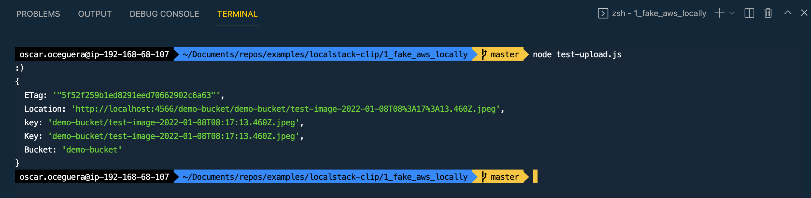

Copy the URL in the Location property of the response and paste it into your browser. The browser will immediately download the image. If you want to see it in your browser, you can use something like JS Bin:

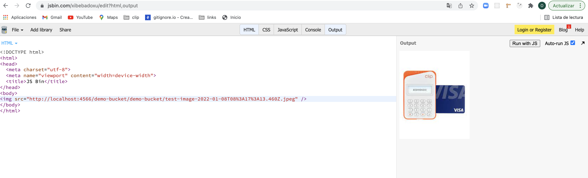

Then, if you look at .localstack/data/recorded_api_calls.json again, you'll see it filled up with the binary data of the image:

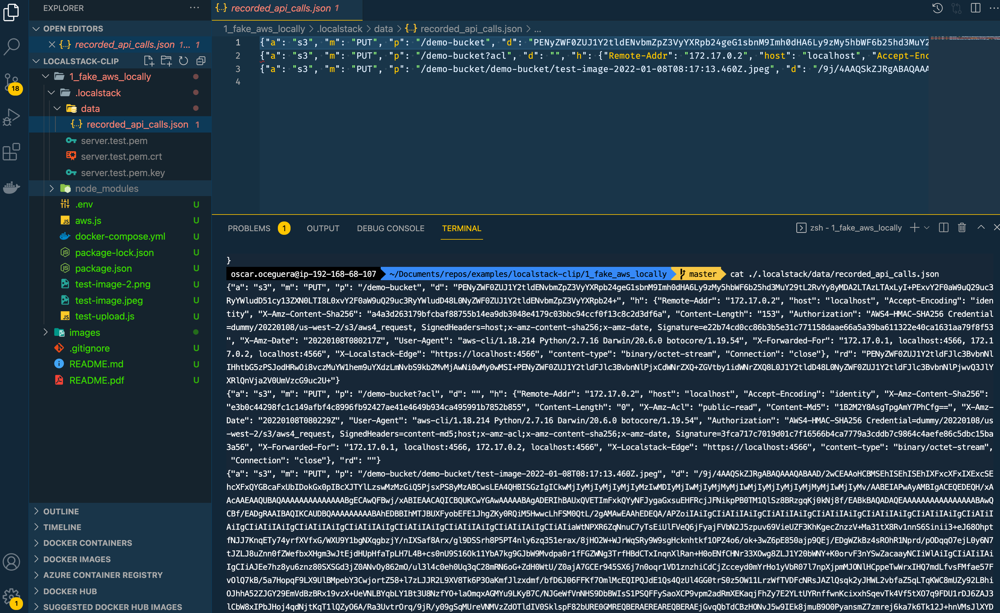

**EXERCISE**

Add a Endpoint to upload files (images) and other that list all images, install:

- express
- express-fileupload

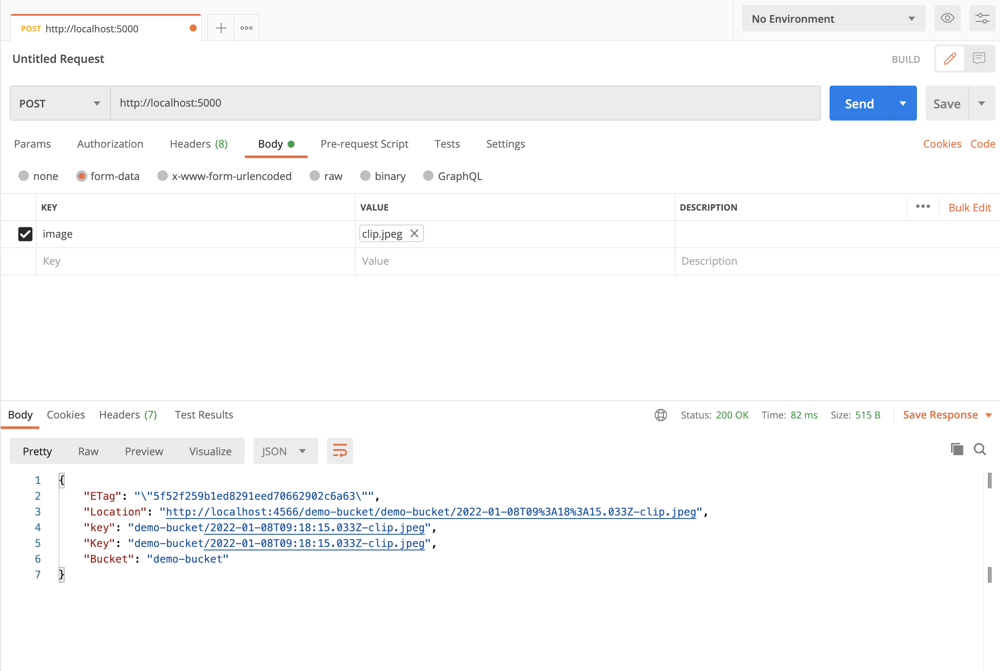

---

## Second Goal (Localstack/Nodejs/DynamoDB/Swagger/Jest)

- Create a new directory for you project
- Within it a new nodejs project `npm init -y`.
- install dependecies with npm:
  - `npm install --save aws-sdk body-parser cors express swagger-ui-express xid-js`
  - `npm install --save-dev jest nodemon supertest`
- Create new files:
  - src/index.js
  - src/app.js
  - src/router.js
  - src/tests/integration.test.js
  - src/swagger.json
  - Dockerfile
  - .dockerignore
  - config.js
  - docker-compose.yml
  - jest.config.js

**Configs `src/config.js`**

```javascript
const required = ["NODE_ENV"];
required.forEach((param) => {
  if (!process.env[param]) {
    throw new Error(`Environment parameter ${param} is missing`);
  }
});
const config = {
  env: process.env["NODE_ENV"],
};

module.exports = config;
```

**Setup routes `src/routes`**

```javascript
const express = require("express");
const router = express.Router();

module.exports = router;
```

**Begin a simple express server `src/app.js`**

```javascript
const express = require("express");
const bodyParser = require("body-parser");
const cors = require("cors");

const router = require("./router");
const swaggerUI = require("swagger-ui-express");
const swaggerDocument = require("./swagger.json");
const app = express();

app.use(cors());

app.get("/", (req, res) => {
  const msg = {
    message: "Welcome to API!",
  };

  res.status(200).send(msg);
});

app.get("/status", (req, res) => {
  const status = {
    status: "ok",
    api: "soccer-player-api",
    time: Date.now(),
  };
  res.status(200).send(status);
});

router.use("/docs", swaggerUI.serve, swaggerUI.setup(swaggerDocument));

app.use(bodyParser.json());
app.use(
  bodyParser.urlencoded({
    extended: true,
  })
);

app.use((req, res, next) => {
  res.removeHeader("X-Powered-By");
  next();
});

app.use("/", router);

module.exports = app;
```

**Write document `src/swagger.json`**

```json
{
  "openapi": "3.0.0",
  "info": {
    "title": "Soccer Players API",
    "description": "Tiny RESTful API using Node.js: allows you to manage soccer players.",
    "contact": {
      "name": "Mauro Bonfietti",
      "url": "https://github.com/maurobonfietti"
    },
    "version": "1.0"
  },
  "paths": {
    "/": {
      "get": {
        "tags": ["Info"],
        "summary": "Get help",
        "description": "Get help about this API.",
        "operationId": "Gethelp",
        "parameters": [],
        "responses": {
          "200": {
            "description": "",
            "headers": {
              "X-Powered-By": {
                "content": {
                  "text/plain": {
                    "schema": {
                      "type": "string"
                    },
                    "example": "Express"
                  }
                }
              },
              "Access-Control-Allow-Origin": {
                "content": {
                  "text/plain": {
                    "schema": {
                      "type": "string"
                    },
                    "example": "*"
                  }
                }
              },
              "Content-Length": {
                "content": {
                  "text/plain": {
                    "schema": {
                      "type": "string"
                    },
                    "example": "43"
                  }
                }
              },
              "ETag": {
                "content": {
                  "text/plain": {
                    "schema": {
                      "type": "string"
                    },
                    "example": "W/\"2b-h6BMmxGhWkCo5dA5bJgq/pDo3sQ\""
                  }
                }
              },
              "Date": {
                "content": {
                  "text/plain": {
                    "schema": {
                      "type": "string"
                    },
                    "example": "Mon, 23 Dec 2019 21:03:20 GMT"
                  }
                }
              },
              "Connection": {
                "content": {
                  "text/plain": {
                    "schema": {
                      "type": "string"
                    },
                    "example": "keep-alive"
                  }
                }
              }
            },
            "content": {
              "application/json; charset=utf-8": {
                "schema": {
                  "$ref": "#/components/schemas/Gethelp"
                },
                "example": {
                  "message": "Welcome to Soccer Player API!"
                }
              }
            }
          }
        },
        "deprecated": false
      }
    },
    "/status": {
      "get": {
        "tags": ["Info"],
        "summary": "Health check",
        "description": "Get status of this API.",
        "operationId": "Healthcheck",
        "parameters": [],
        "responses": {
          "200": {
            "description": "",
            "headers": {
              "X-Powered-By": {
                "content": {
                  "text/plain": {
                    "schema": {
                      "type": "string"
                    },
                    "example": "Express"
                  }
                }
              },
              "Access-Control-Allow-Origin": {
                "content": {
                  "text/plain": {
                    "schema": {
                      "type": "string"
                    },
                    "example": "*"
                  }
                }
              },
              "Content-Length": {
                "content": {
                  "text/plain": {
                    "schema": {
                      "type": "string"
                    },
                    "example": "62"
                  }
                }
              },
              "ETag": {
                "content": {
                  "text/plain": {
                    "schema": {
                      "type": "string"
                    },
                    "example": "W/\"3e-r8UILbmoe9Rk/g5iPSk00uuUUuk\""
                  }
                }
              },
              "Date": {
                "content": {
                  "text/plain": {
                    "schema": {
                      "type": "string"
                    },
                    "example": "Mon, 23 Dec 2019 21:03:27 GMT"
                  }
                }
              },
              "Connection": {
                "content": {
                  "text/plain": {
                    "schema": {
                      "type": "string"
                    },
                    "example": "keep-alive"
                  }
                }
              }
            },
            "content": {
              "application/json; charset=utf-8": {
                "schema": {
                  "$ref": "#/components/schemas/Healthcheck"
                },
                "example": {
                  "status": "ok",
                  "api": "soccer-player-api",
                  "time": 1577135007891
                }
              }
            }
          }
        },
        "deprecated": false
      }
    }
  },
  "components": {
    "schemas": {
      "Gethelp": {
        "title": "Gethelp",
        "required": ["message"],
        "type": "object",
        "properties": {
          "message": {
            "type": "string"
          }
        },
        "example": {
          "message": "Welcome to Soccer Player API!"
        }
      },
      "Healthcheck": {
        "title": "Healthcheck",
        "required": ["status", "api", "time"],
        "type": "object",
        "properties": {
          "status": {
            "type": "string"
          },
          "api": {
            "type": "string"
          },
          "time": {
            "type": "integer",
            "format": "int64"
          }
        },
        "example": {
          "status": "ok",
          "api": "soccer-player-api",
          "time": 1577135007891
        }
      }
    }
  },
  "tags": [
    {
      "name": "Info",
      "description": "Endpoints to get info about the API."
    },
    {
      "name": "Players",
      "description": "Endpoints to get and manage soccer players."
    }
  ]
}
```

**Listening the server `src/index.js`**

```javascript
const app = require("./app");
const PORT = 3000;

app.use((req, res) => {
  res.status(404);
  res.send({ error: "Not Found -  Error 404." });
});

app.listen(PORT, () =>
  console.log(`Server listening @ http://localhost:${PORT}`)
);
```

**Modify the package.json script section**

```json
...
"scripts": {
        "start": "node src/index.js",
        "local": "nodemon --inspect=0.0.0.0:9229 src/index.js",
        "test": "jest --coverage"
    },
...
```

**Start the server with `npm start`**

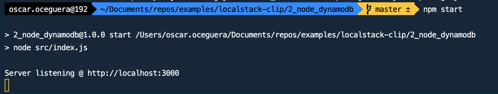

**Consult documentation `http://localhost:3000/docs`**

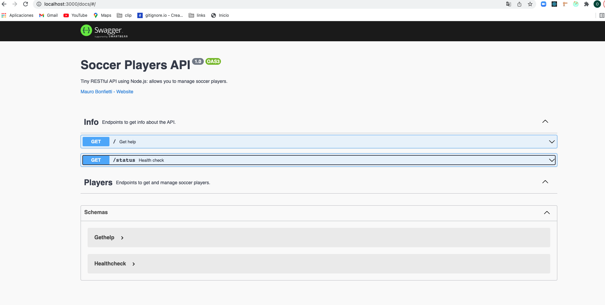

**Write some simple tests `src/tests/integration.test.js`**

```javascript
const request = require("supertest");
const app = require("../app");

describe("Integration Test for the API", () => {
  describe("GET /", () => {
    it("should response 200", async () => {
      const res = await request(app).get("/");
      expect(res.statusCode).toEqual(200);
      expect(res.body).toHaveProperty("message");
    });
  });

  describe("GET /status", () => {
    it("should response 200", async () => {
      const res = await request(app).get("/status");
      expect(res.statusCode).toEqual(200);
      expect(res.body).toHaveProperty("status", "api", "time");
    });
  });
});
```

**Write `jest.config.js`**

```javascript
// For a detailed explanation regarding each configuration property, visit:
// https://jestjs.io/docs/en/configuration.html

module.exports = {
  coverageDirectory: "coverage",
  testEnvironment: "node",
};
```

**Run `npm test`**
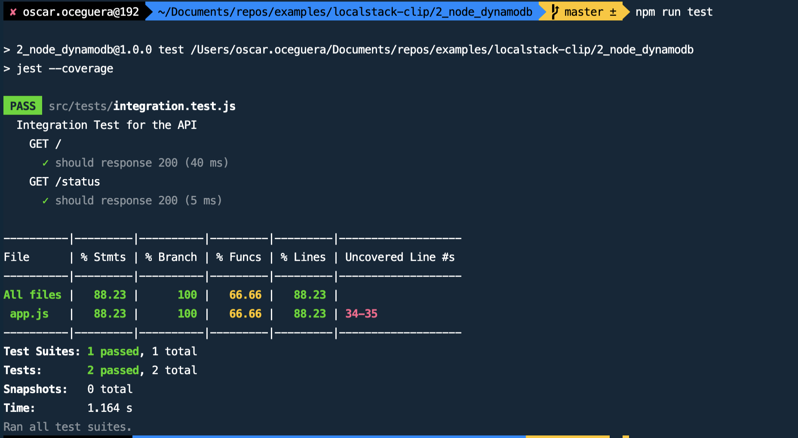

**Setup**

Create a folder **setup** and add the next files:

- [Create-players.json](https://gist.github.com/oscaroceguera/e35f94112069e975856bd4b70b82e576)
- [players-v1.json](https://gist.github.com/oscaroceguera/ca9ddcc352a5d77dd01b557c284fabab)
- [players-v2.json](https://gist.github.com/oscaroceguera/b4eb6713b1ec3c15c9b9f9a75c7f7f09)
- [players-v3.json](https://gist.github.com/oscaroceguera/e110cb61cd0114434180fa2d5927e151s)
- [setup.sh](https://gist.github.com/oscaroceguera/173b68b299ab9feafa2013fe4a969061)

**Dockerizing node.js web app `Dockerfile`**

```
FROM node:13-alpine
WORKDIR /app
COPY . .
RUN ["npm", "install"]
EXPOSE 3000
ENTRYPOINT ["npm", "start"]
```

**Config your `docker-compose.yml` file**

```yml
version: "3.6"
x-common-variables: &common-variables
  NODE_ENV: local
  AWS_ACCESS_KEY_ID: anykey
  AWS_SECRET_ACCESS_KEY: anysecret
  AWS_REGION: us-east-2
services:
  local:
    build:
      context: .
    image: soccer-player-api
    volumes:
      - ./src:/app/src
    container_name: soccer-player-api_local
    environment: *common-variables
    ports:
      - "3000:3000"
      - "9229:9229"
    tty: true
    entrypoint: ["npm", "run", "local"]
  test:
    build:
      context: .
    image: soccer-player-api
    volumes:
      - ./src:/app/src
      - ./coverage/unit:/app/coverage
    container_name: soccer-player-api_test
    environment: *common-variables
    tty: true
    entrypoint: ["npm", "test"]
  localstack:
    image: localstack/localstack
    container_name: soccer-player-api_localstack
    environment:
      SERVICES: dynamodb
    ports:
      - "4569:4569"
  setup:
    image: mesosphere/aws-cli
    container_name: soccer-player-api_setup
    volumes:
      - ./setup:/setup
    environment:
      AWS_ACCESS_KEY_ID: anykey
      AWS_SECRET_ACCESS_KEY: anysecret
      AWS_DEFAULT_REGION: us-east-2
    depends_on:
      - localstack
    entrypoint: [""]
    command: ["/setup/setup.sh"]
networks:
  default:
    name: soccer-player-api
```

_NOTE: use `chmod +x the_file_name` if you need permission for setup.sh file_

**Run `docker-compose up localstack setup`**
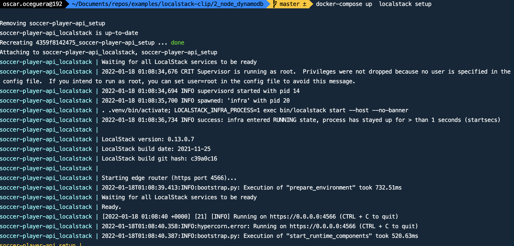

**Run `docker-compose up local`**
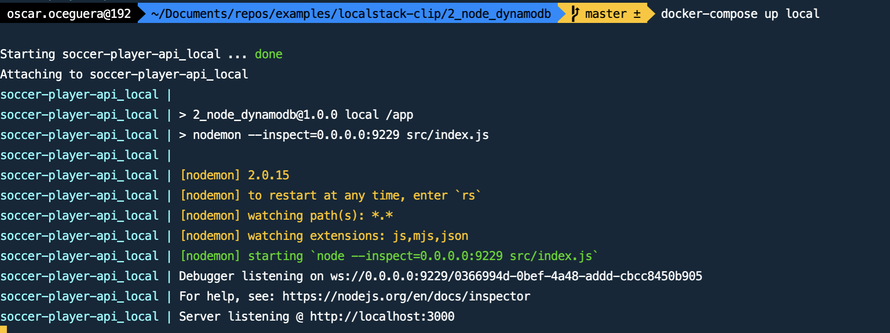

**Run `docker-compose up test`**
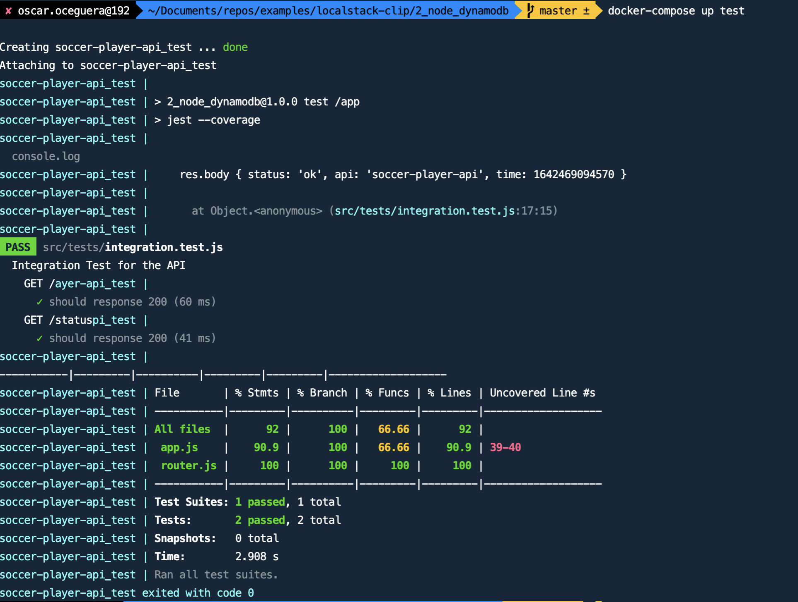

### Build our EndPoints

- Add new files:
  - src/repositories/dynamodb.repository.js
  - src/daos/players.dao.js
  - src/models/players.model.js
  - src/controllers/players.controller.js

**Connect to DynamoDB `src/repositories/dynamodb.repository.js`**

```javascript
const AWS = require("aws-sdk");

const dynamodb = new AWS.DynamoDB.DocumentClient({
  service: new AWS.DynamoDB({ apiVersion: "2012-08-10" }),
});

const manageRequest = (method, params) => {
  return new Promise((resolve, reject) => {
    dynamodb[method](params, (error, response) => {
      if (error) {
        reject(error);
      } else {
        resolve(response);
      }
    });
  });
};

class DynamodbRepository {
  static get(params) {
    return manageRequest("get", params);
  }

  static query(params) {
    return manageRequest("query", params);
  }

  static update(params) {
    return manageRequest("update", params);
  }

  static put(params) {
    return manageRequest("put", params);
  }

  static delete(params) {
    return manageRequest("delete", params);
  }
}

module.exports = DynamodbRepository;
```

**Create a DAO (Data Access Object) `src/daos/players.dao.js`**

```javascript
const dynamodbRepository = require("../repositories/dynamodb.repository");

class PlayersDao {
  static async getPlayers(limit = 500) {
    const params = {
      TableName: "players",
      KeyConditionExpression: "mytype = :mytype",
      ExpressionAttributeValues: {
        ":mytype": "player",
      },
      ProjectionExpression: "playerId, fullname, myposition",
      ScanIndexForward: true,
      Limit: limit,
    };
    const result = await dynamodbRepository.query(params);

    return result.Items;
  }

  static async getPlayer(playerId) {
    const params = {
      TableName: "players",
      IndexName: "playerId-index",
      KeyConditionExpression: "playerId = :playerId",
      ExpressionAttributeValues: {
        ":playerId": playerId,
      },
      ProjectionExpression: "playerId, fullname, myposition",
      Limit: 1,
    };
    const result = await dynamodbRepository.query(params);

    return result.Items;
  }

  static async insertPlayer(item) {
    const params = {
      TableName: "players",
      Item: item,
      ReturnValues: "NONE",
    };

    return dynamodbRepository.put(params);
  }

  static async updatePlayer(playerId, myposition, fullname) {
    const params = {
      TableName: "players",
      Key: {
        mytype: "player",
        playerId: playerId.toString(),
      },
      UpdateExpression: `set fullname = :fullname, myposition = :myposition`,
      ExpressionAttributeValues: {
        ":myposition": myposition,
        ":fullname": fullname,
      },
      ReturnValues: "ALL_NEW",
    };

    return dynamodbRepository.update(params);
  }

  static async deletePlayer(playerId) {
    const params = {
      TableName: "players",
      Key: {
        mytype: "player",
        playerId: playerId.toString(),
      },
    };

    return dynamodbRepository.delete(params);
  }

  static async getPlayersByPosition(myposition, limit = 25) {
    const params = {
      TableName: "players",
      IndexName: "myposition-playerId-index",
      KeyConditionExpression: "myposition = :myposition",
      ExpressionAttributeValues: {
        ":myposition": myposition,
      },
      ProjectionExpression: "fullname, myposition",
      ScanIndexForward: false,
      Limit: limit,
    };
    const result = await dynamodbRepository.query(params);

    return result.Items;
  }
}

module.exports = PlayersDao;
```

**Create model `src/models/players.model.js`**

```javascript
const playersDao = require("../daos/players.dao");

const shuffle = (array) => {
  for (let i = array.length - 1; i > 0; i--) {
    let j = Math.floor(Math.random() * (i + 1));
    [array[i], array[j]] = [array[j], array[i]];
  }
};

class PlayersModel {
  static getPlayers() {
    return playersDao.getPlayers();
  }

  static getPlayer(playerId) {
    return playersDao.getPlayer(playerId);
  }

  static async insertPlayer(playerId, mytype, myposition, fullname) {
    const item = { playerId, mytype, myposition, fullname };

    return playersDao.insertPlayer(item);
  }

  static async updatePlayer(playerId, myposition, fullname) {
    return playersDao.updatePlayer(playerId, myposition, fullname);
  }

  static deletePlayer(playerId) {
    return playersDao.deletePlayer(playerId);
  }

  static async getDreamTeam() {
    const goalkeeper = await this.getPlayersByPosition("goalkeeper", 1);
    const defenders = await this.getPlayersByPosition("defender", 4);
    const midfielders = await this.getPlayersByPosition("midfielder", 3);
    const forwards = await this.getPlayersByPosition("forward", 3);

    return [goalkeeper, defenders, midfielders, forwards];
  }

  static async getPlayersByPosition(position, quantity) {
    const p = await playersDao.getPlayersByPosition(position);
    console.log(p.length);
    shuffle(p);
    const players = [];
    for (var i = 0; i < quantity; i++) {
      players.push(p[i]);
    }

    return players;
  }
}

module.exports = PlayersModel;
```

**Create our controllers `src/controllers/players.controllers.js`**

```javascript
const playersModel = require("../models/players.model");
const xid = require("xid-js");

const generateUuid = () => {
  return xid.next();
};

const isValidString = (value) => {
  return typeof value === "string" && value.trim().length > 0;
};

class PlayersController {
  static async getPlayers(req, res) {
    const callId = generateUuid();
    console.log("Call %s %s id: %s", req.method, req.url, callId);
    try {
      const result = await playersModel.getPlayers();
      console.log("Call id: %s response: %s", callId, JSON.stringify(result));
      console.log(result.length);
      res.status(200).send(result);
    } catch (error) {
      console.log("Call id: %s error: %s", callId, error);
      res.status(500).send({ error: "Internal Server Error." });
    }
  }

  static async getPlayer(req, res) {
    const playerId = req.params.playerId;
    const callId = generateUuid();
    console.log("Call %s %s id: %s", req.method, req.url, callId);
    try {
      const result = await playersModel.getPlayer(playerId);
      console.log("Call id: %s response: %s", callId, JSON.stringify(result));
      if (Array.isArray(result) && result.length) {
        res.status(200).send(result);
      } else {
        res.status(404).send({ error: "Player Not Found." });
      }
    } catch (error) {
      console.log("Call id: %s error: %s", callId, error);
      res.status(500).send({ error: "Internal Server Error." });
    }
  }

  static async insertPlayer(req, res) {
    const { playerId, myposition, fullname } = req.body;
    const callId = generateUuid();
    const mytype = "player";
    console.log(
      "Call %s %s id: %s body: %s",
      req.method,
      req.url,
      callId,
      JSON.stringify(req.body)
    );
    if (
      !isValidString(playerId) ||
      !isValidString(myposition) ||
      !isValidString(fullname)
    ) {
      console.log(
        "Call id: %s error:%s",
        callId,
        JSON.stringify("Missing info.")
      );
      return res.status(400).send({ error: "Player info is incomplete." });
    }
    try {
      await playersModel.insertPlayer(playerId, mytype, myposition, fullname);
      console.log("Call id: %s response: %s", callId, "Player created.");
      res.status(201).send({ message: "Player created." });
    } catch (error) {
      console.log("Call id: %s error: %s", callId, error);
      res.status(500).send({ error: "Internal Server Error." });
    }
  }

  static async updatePlayer(req, res) {
    const playerId = req.params.playerId;
    const { myposition, fullname } = req.body;
    const callId = generateUuid();
    console.log(
      "Call %s %s id: %s body: %s params: %s",
      req.method,
      req.url,
      callId,
      JSON.stringify(req.body),
      JSON.stringify(req.params)
    );
    if (
      !isValidString(playerId) ||
      !isValidString(myposition) ||
      !isValidString(fullname)
    ) {
      console.log(
        "call id: %s error:%s",
        callId,
        JSON.stringify("Missing info.")
      );
      return res.status(400).send({ error: "Player info is incomplete." });
    }
    try {
      await playersModel.updatePlayer(playerId, myposition, fullname);
      console.log("call id:%s result:%s ", callId, "Player updated.");
      res.status(200).send({ message: "Player updated." });
    } catch (error) {
      console.log("Call id: %s error: %s", callId, error);
      res.status(500).send({ error: "Internal Server Error." });
    }
  }

  static async deletePlayer(req, res) {
    const playerId = req.params.playerId;
    const callId = generateUuid();
    console.log("Call %s %s id: %s", req.method, req.url, callId);
    try {
      const result = await playersModel.deletePlayer(playerId);
      console.log("Call id: %s response: %s", callId, JSON.stringify(result));
      res.status(204).send(result);
    } catch (error) {
      console.log("Call id: %s error: %s", callId, error);
      res.status(500).send({ error: "Internal Server Error." });
    }
  }

  static async getDreamTeam(req, res) {
    const callId = generateUuid();
    console.log("Call %s %s id: %s", req.method, req.url, callId);
    try {
      const team = await playersModel.getDreamTeam();
      console.log("Call id: %s response: %s", callId, JSON.stringify(team));
      console.log(team);
      res.status(200).send(team);
    } catch (error) {
      console.log("Call id: %s error: %s", callId, error);
      res.status(500).send({ error: "Internal Server Error." });
    }
  }
}

module.exports = PlayersController;
```

**Add controllers within `src/router.js`**

```javascript
const express = require("express");
const router = express.Router();
const version = "v1";
const playersController = require("./controllers/players.controller");

router.get(`/${version}/players`, playersController.getPlayers);
router.get(`/${version}/players/dream-team`, playersController.getDreamTeam);
router.get(`/${version}/players/:playerId`, playersController.getPlayer);
router.post(`/${version}/players`, playersController.insertPlayer);
router.patch(`/${version}/players/:playerId`, playersController.updatePlayer);
router.delete(`/${version}/players/:playerId`, playersController.deletePlayer);

module.exports = router;
```

**Add routes and aws connection `src/app.js`**

```javascript
const express = require("express");
const bodyParser = require("body-parser");
const cors = require("cors");
const AWS = require("aws-sdk");
const config = require("./config");
if (config.env === "local") {
  AWS.config.dynamodb = { endpoint: "http://localstack:4569" };
}
const router = require("./router");
const swaggerUI = require("swagger-ui-express");
const swaggerDocument = require("./swagger.json");
const app = express();

app.use(cors());

app.get("/", (req, res) => {
  const msg = {
    message: "Welcome to Soccer Player API!",
  };
  res.status(200).send(msg);
});

app.get("/status", (req, res) => {
  const status = {
    status: "ok",
    api: "soccer-player-api",
    time: Date.now(),
  };
  res.status(200).send(status);
});

router.use("/docs", swaggerUI.serve, swaggerUI.setup(swaggerDocument));

app.use(bodyParser.json());
app.use(
  bodyParser.urlencoded({
    extended: true,
  })
);

app.use((req, res, next) => {
  res.removeHeader("X-Powered-By");
  next();
});

app.use("/", router);

module.exports = app;
```

**Run localstack, dynamoDB and local API**

- `docker-compose up localstack setup`
- `docker-compose up local`
